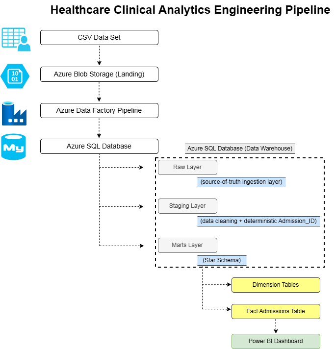
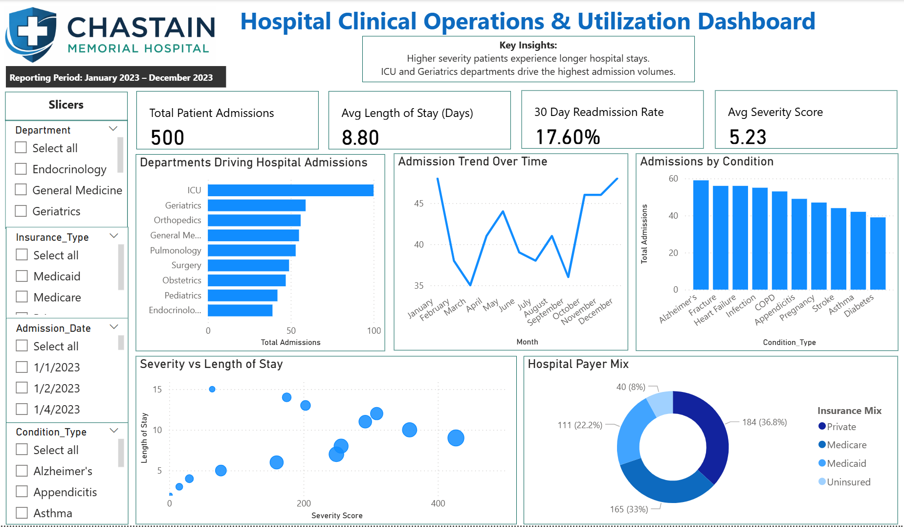

# Healthcare Clinical Analytics Engineering Project

End-to-end analytics engineering project modeling clinical encounter data into a star schema for BI consumption.

## Overview
This project demonstrates an end-to-end analytics engineering workflow using a simulated hospital admissions dataset. The goal was to move beyond simple dashboarding and build a structured, production-style data model using layered architecture and dimensional modeling principles.

I intentionally designed this project to reflect how data flows in a real environment, including ingestion, transformation, validation, and analytics-ready modeling.

## Architecture
Blob Storage (Landing)  
Azure Data Factory (Ingestion Pipeline)  
Azure SQL Database  

This project demonstrates an end-to-end healthcare clinical analytics engineering pipeline built using Azure cloud services and a layered data warehouse architecture.

The pipeline begins with a CSV dataset stored in Azure Blob Storage as the landing zone. Azure Data Factory orchestrates ingestion and loads the data into an Azure SQL Database.

Inside the database, the warehouse is structured using three logical layers:

- Raw Layer stores the source-of-truth ingestion table exactly as it arrives
- Staging Layer performs data cleaning and transformations, including generating a deterministic Admission_ID when a natural encounter key is not available
- Marts Layer implements a dimensional star schema designed for analytics and reporting

The final analytics-ready star schema is consumed by Power BI to produce the Clinical Operations Dashboard for hospital leadership.

This structure mirrors how modern analytics engineering teams organize pipelines to separate ingestion, transformation, and analytics-ready modeling.

## Data Warehouse Structure
- raw stores source-of-truth ingestion data
- staging handles transformations and Admission_ID logic
- marts contains the star schema with fact and dimension tables

This separation ensures clarity, maintainability, and controlled business logic application.

## Key Engineering Decisions
- Created a deterministic Admission_ID because the dataset lacked a natural encounter key
- Separated raw and staging layers to prevent business logic contamination
- Built a full star schema with surrogate keys
- Implemented validation queries to confirm row integrity and uniqueness
- Designed fact table with proper foreign key relationships

## Final Model Includes
- dim_patient (500)
- dim_department (9)
- dim_condition (10)
- dim_insurance (4)
- fact_admissions_star (500)

## Data Quality Validation
- Raw vs staging vs mart row counts validated
- Admission_ID uniqueness confirmed
- Null checks on critical fields

## Tools Used
- Azure SQL Database
- Azure Data Factory
- Azure Blob Storage
- VS Code
- GitHub

## Why This Project Matters
This project reflects the transition from traditional analytics to analytics engineering. Instead of focusing only on reporting outputs, the emphasis was placed on data modeling, structured transformations, reproducibility, and clean architecture.

This approach ensures downstream analytics tools connect to a reliable, well-designed warehouse layer rather than raw transactional data.

## BI Layer Clinical Operations Dashboard
The final consumption layer of the pipeline is a Power BI dashboard designed for hospital leadership to monitor operational performance.

The dashboard provides visibility into:
- Total Patient Admissions
- Average Length of Stay
- Patient Severity Distribution
- Department-level Admission Trends
- Clinical Conditions Driving Hospital Utilization
- Hospital Payer Mix

These metrics allow stakeholders to quickly identify utilization patterns and patient complexity across departments.

### Dashboard Preview

### Dashboard File
powerbi/hospital_clinical_operations_dashboard.pbix
